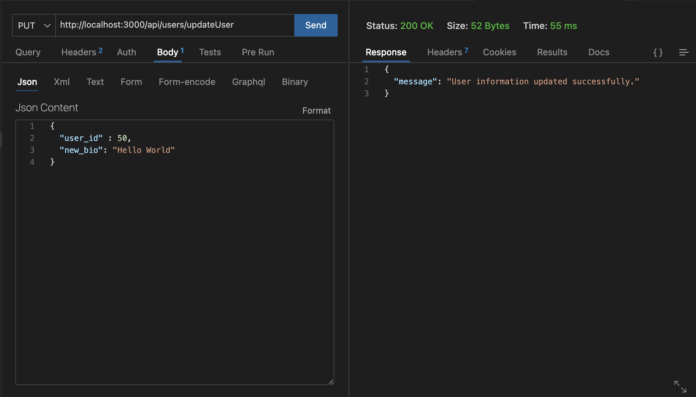
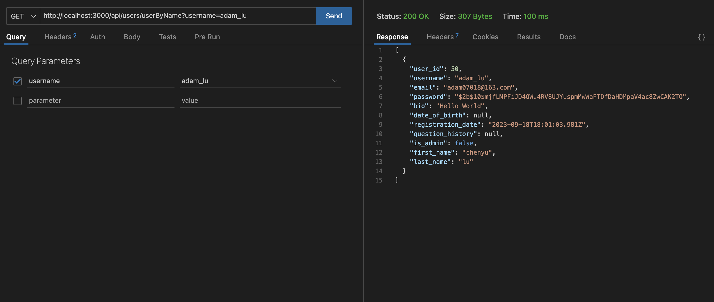
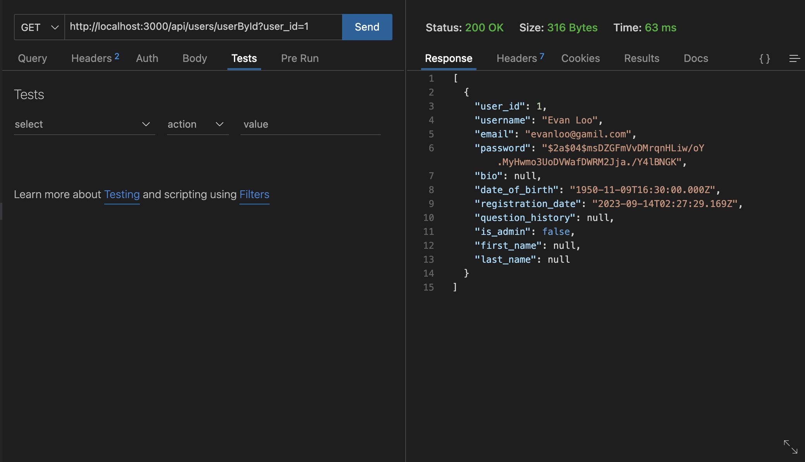
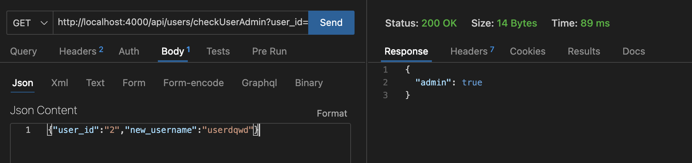

# **_User Profile Backend_**

## api main route: http://localhost:4000/api/users

1. ## update User

   - Use http **put**
   - /updateUser
   - **"user_id"** is compulsory
   - ```json
      {
      "user_id" : 1,
      "new_username” : "test",
      “new_password” : "test",
      “new_bio” : "test bio",
      "new_email" : "test"
      }
     ```
   - 

2. ## Create User
   - Use http **post**
   - /createUser
   - **"username", "password", "email"** is compulsory
   - ```json
      {
      "username" : "test",
      "password" : "test",
      "email" : " xxxxxxx@email.com",
      "date_of_birth" : "1980-01-01",
      "bio" : "test bio",
      "first_name" : "test",
      "last_name" : "test
      }
     ```
3. ## get Users

   - **Get all users**
   - Use http get
   - /users
   - http://localhost:4000/api/users/users

4. ## get User by name
   - **Get user by username**
   - Use http **get**
   - /userByName/:name
   - **"username"** is compulsory
   - Pass in user name as http query parameter
   - http://localhost:4000/api/users/userByName?username=adam_lu
   - 
5. ## get User by id
   - **Get user by user_id**
   - Use http **get**
   - **"user_id"** is compulsory
   - Pass in user_id as http query parameter
   - http://localhost:4000/api/users/userById?user_id=1
   - -
6. ## check if user is admin
   - /checkUserAdmin
   - Use http **get**
   - Pass in username as http query parameter
   - http://localhost:4000/api/users/checkUserAdmin?username=adam_lu
   - -
7. ## Set user to be admin
   - **Need to be admin authenticated**
   - /setUserAdmin
   - use http **put**
   - Pass in username as http query parameter
   - http://localhost:4000/api/users/setUserAdmin?username=rugatugtuck
   -
